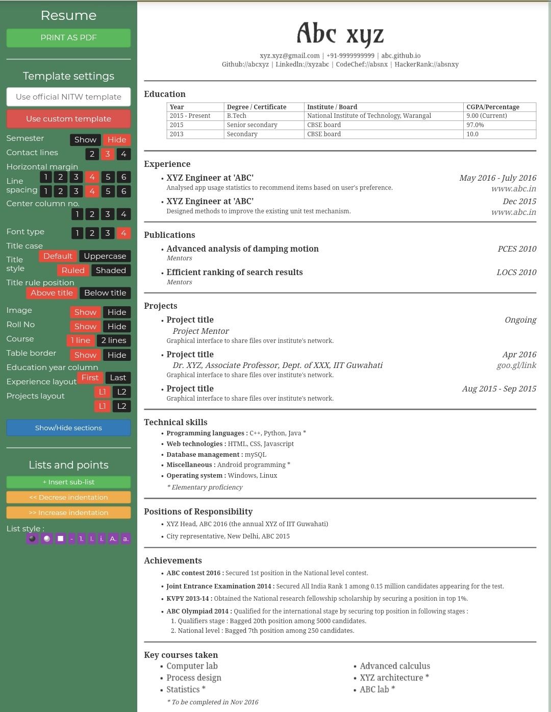
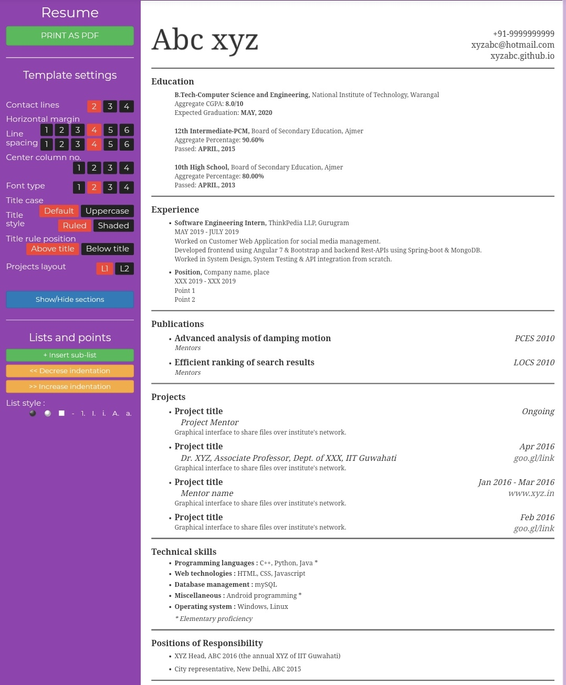
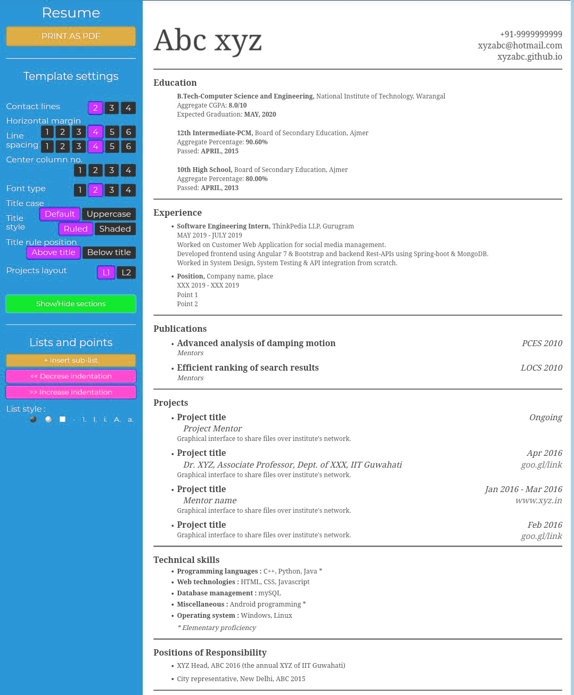

<div align="center">

# 📄 Resume Builder

### A web-based resume editor with multiple customizable templates and PDF export

[](https://developer.mozilla.org/en-US/docs/Web/HTML)
[](https://developer.mozilla.org/en-US/docs/Web/CSS)
[](https://developer.mozilla.org/en-US/docs/Web/JavaScript)
[](https://getbootstrap.com/)
[](https://www.php.net/)
[](https://www.python.org/)

[](https://github.com/iabhishek18/Resume-Builder/issues)
[](https://github.com/iabhishek18/Resume-Builder/stargazers)
[](https://github.com/iabhishek18/Resume-Builder/network)
[](./LICENSE)

---

**Build your professional resume in minutes — no sign-up required.**

[View Demo](#-demo) · [Report Bug](https://github.com/iabhishek18/Resume-Builder/issues/new?template=bug_report.md) · [Request Feature](https://github.com/iabhishek18/Resume-Builder/issues/new?template=feature_request.md)

</div>

---

## 📖 Table of Contents

- [About The Project](#-about-the-project)
- [Demo](#-demo)
- [Templates](#-templates)
- [Features](#-features)
- [Tech Stack](#-tech-stack)
- [Project Structure](#-project-structure)
- [Getting Started](#-getting-started)
- [Usage Guide](#-usage-guide)
- [PDF Merge & Compress](#-pdf-merge--compress)
- [Contributing](#-contributing)
- [License](#-license)
- [Contact](#-contact)

---

## 🧐 About The Project

**Resume Builder** is a fully client-side, browser-based resume editor that lets you create professional resumes using customizable templates. Edit content directly in the browser like a document editor, tweak formatting with an intuitive sidebar, and export your resume as a PDF — all without creating an account or sending your data anywhere.

### Why Resume Builder?

- ✅ **No sign-up** — Start building immediately
- ✅ **Privacy first** — All data stays in your browser
- ✅ **Multiple templates** — Choose from 3 professionally designed layouts
- ✅ **Highly customizable** — Control fonts, spacing, margins, section visibility & more
- ✅ **Free & open source** — Use it, modify it, share it

---

## 🎬 Demo

### Template Previews

The landing page provides easy navigation to all three resume templates:

<div align="center">
  
  &nbsp;&nbsp;
  
  &nbsp;&nbsp;
  
</div>

> **Note:** For the best experience, use **Google Chrome**.

---

## 🎨 Templates

| # | Template | Directory | Description |
|---|----------|-----------|-------------|
| 1 | **Standard** | `templates/standard/` | Classic academic-style layout with tabular education section, ideal for university students |
| 2 | **Modern** | `templates/modern/` | Clean, contemporary design with a purple-accented sidebar and streamlined sections |
| 3 | **Basic** | `templates/basic/` | Minimalist template with a cyan theme, perfect for a quick professional resume |

Each template includes sections for:

> Education · Experience · Publications · Projects · Technical Skills · Positions of Responsibility · Achievements · Key Courses · Hobbies · Fields of Interest · Links · References

Each template also ships with a **cover letter** template inside its `cover-letter/` subdirectory.

---

## ✨ Features

### Editor
| Feature | Description |
|---------|-------------|
| 📝 **WYSIWYG Editing** | Edit resume content directly — supports cut, copy, paste, undo/redo |
| 📂 **Section Management** | Add, reorder, or remove entire sections via cut/copy/paste |
| 👁️ **Toggle Visibility** | Show or hide sections while retaining their content |
| 🎛️ **Sidebar Controls** | Modify template settings, formatting, and layout from the left panel |
| 📋 **Sub-points & Bullets** | Add sub-lists with multiple bullet styles and adjustable indentation |
| 🖨️ **Print to PDF** | One-click export to PDF directly from the browser |

### Template Settings
| Setting | Options |
|---------|---------|
| Contact Lines | 2 / 3 / 4 lines |
| Horizontal Margin | 6 levels |
| Line Spacing | 6 levels |
| Center Column Number | 1–4 columns |
| Font Type | 4 font options |
| Title Case | Default / Uppercase |
| Title Style | Ruled / Shaded |
| Title Rule Position | Above Title / Below Title |
| Projects Layout | L1 / L2 |
| Show/Hide Sections | Toggle any section on or off |

---

## 🛠️ Tech Stack

| Layer | Technology |
|-------|-----------|
| **Frontend** | HTML5, CSS3, JavaScript (ES5) |
| **UI Framework** | Bootstrap 3 (minified) |
| **DOM Manipulation** | jQuery, jQuery UI |
| **Backend (optional)** | PHP (entry-point wrapper) |
| **Utility Script** | Python 3 (PDF merge & compress) |
| **Fonts** | Glyphicons Halflings, Google Fonts (Karla, Roboto, Droid Serif, Montserrat, Amarante) |

---

## 📁 Project Structure

```
Resume-Builder/
├── index.html                         # Landing page — template selection
├── index.php                          # PHP wrapper for index.html
├── composer.json                      # PHP Composer config
├── LICENSE                            # MIT License
├── README.md                          # This file
│
├── assets/                            # Landing page static assets
│   ├── css/
│   │   └── main.css                   # Compiled landing page styles
│   └── images/
│       ├── template-standard-preview.jpeg
│       ├── template-modern-preview.jpeg
│       ├── template-basic-preview.jpg
│       ├── logo.svg
│       ├── facebook.svg
│       ├── instagram.svg
│       ├── twitter.svg
│       └── ...                        # Other landing page images
│
├── scripts/                           # Shared utility scripts
│   └── compress_pdf.py                # Merge & compress multi-page PDFs
│
├── templates/                         # Resume templates
│   ├── standard/                      # Template 1 — Standard Resume
│   │   ├── index.html                 # Template editor page
│   │   ├── letter.html                # Cover letter editor
│   │   ├── css/
│   │   │   ├── bootstrap.min.css
│   │   │   ├── main.css               # Core template styles
│   │   │   ├── theme.css              # Color theme
│   │   │   ├── column-scroll.css      # Column scroll behavior
│   │   │   └── thin-scroll.css        # Thin scrollbar styles
│   │   ├── js/
│   │   │   ├── main.js                # Core editor logic
│   │   │   ├── jquery.min.js
│   │   │   ├── jquery-ui.min.js
│   │   │   └── bootstrap.min.js
│   │   ├── fonts/                     # Glyphicon web fonts
│   │   ├── images/                    # Template-specific images
│   │   │   └── nit-warangal-logo.png
│   │   └── cover-letter/              # Cover letter assets
│   │       ├── letter.html
│   │       └── letter.css
│   │
│   ├── modern/                        # Template 2 — Modern Resume
│   │   └── ...                        # (same structure as standard)
│   │
│   └── basic/                         # Template 3 — Basic Resume
│       └── ...                        # (same structure as standard)
│
└── .github/
    └── ISSUE_TEMPLATE/
        ├── bug_report.md
        └── feature_request.md
```

### Naming Conventions

| Convention | Example | Rationale |
|------------|---------|-----------|
| **kebab-case** for CSS files | `column-scroll.css`, `thin-scroll.css` | Standard web convention |
| **kebab-case** for image files | `nit-warangal-logo.png`, `template-standard-preview.jpeg` | Consistent, URL-friendly |
| **Descriptive template dirs** | `templates/standard/`, `templates/modern/`, `templates/basic/` | Self-documenting instead of `1/`, `2/`, `3/` |
| **Grouped assets** | `assets/css/`, `assets/images/` | Separation of concerns |
| **Shared scripts** | `scripts/compress_pdf.py` | Single source of truth (no duplication) |
| **Root-level LICENSE** | `LICENSE` | GitHub auto-detection |

---

## 🚀 Getting Started

### Prerequisites

- A modern web browser (Google Chrome recommended)
- *(Optional)* A local web server if you want to use the PHP entry point
- *(Optional)* Python 3 — only needed for the PDF merge & compress script

### Installation

1. **Clone the repository**

   ```bash
   git clone https://github.com/iabhishek18/Resume-Builder.git
   cd Resume-Builder
   ```

2. **Open directly in browser**

   Simply open `index.html` in your browser:

   ```bash
   # macOS
   open index.html

   # Windows
   start index.html

   # Linux
   xdg-open index.html
   ```

3. **Or serve with a local server** *(optional)*

   ```bash
   # Using Python
   python -m http.server 8000

   # Using PHP
   php -S localhost:8000

   # Then visit http://localhost:8000
   ```

---

## 📝 Usage Guide

1. **Select a template** from the landing page (Standard / Modern / Basic)
2. Click **"VIEW INSTRUCTIONS"** in the editor for detailed usage tips
3. **Edit content** directly on the resume — it works like a document editor
4. Use the **left sidebar** to adjust template settings and formatting
5. Use **"Show/Hide sections"** to toggle section visibility
6. Click **"PRINT AS PDF"** to export your resume

### Tips

- Use `Ctrl+Z` / `Ctrl+Y` for undo/redo
- Cut and paste entire sections to reorder them
- Adjust line spacing and margins for multi-page resumes
- Use the bullet style options to customize list formatting

---

## 📑 PDF Merge & Compress

If your resume spans multiple pages, use the included Python script to merge and compress them into a single PDF.

### Steps

1. Save individual pages as PDF from the browser (name them `1.pdf`, `2.pdf`, etc.)

2. Open `scripts/compress_pdf.py` in any text editor and configure:

   ```python
   dir_path = "/path/to/your/pdf/files"   # Directory with your PDFs
   num_of_pages = 2                         # Number of pages to merge
   out_file = "Resume.pdf"                  # Output file name
   ```

3. Run the script:

   ```bash
   python scripts/compress_pdf.py
   ```

> **Note:** You may need to run with `sudo` or adjust file permissions depending on your OS.

---

## 🤝 Contributing

Contributions make the open-source community an amazing place to learn, inspire, and create. Any contributions you make are **greatly appreciated**.

1. **Fork** the repository
2. **Create** your feature branch
   ```bash
   git checkout -b feature/amazing-feature
   ```
3. **Commit** your changes
   ```bash
   git commit -m "feat: add amazing feature"
   ```
4. **Push** to the branch
   ```bash
   git push origin feature/amazing-feature
   ```
5. **Open** a Pull Request

### Contribution Ideas

- [ ] Add more resume templates
- [ ] Add dark mode support
- [ ] Implement local storage to save progress
- [ ] Add cover letter templates for all designs
- [ ] Mobile-responsive editor layout
- [ ] Export to DOCX format
- [ ] Add template color theme picker
- [ ] Deduplicate shared vendor files (`js/`, `fonts/`) into a common directory

---

## 📄 License

This project is licensed under the **MIT License**. See the [`LICENSE`](./LICENSE) file for details.

---

## 📬 Contact

**Abhishek Mishra** — [@iabhishek18](https://github.com/iabhishek18)

Project Link: [https://github.com/iabhishek18/Resume-Builder](https://github.com/iabhishek18/Resume-Builder)

---

<div align="center">

### ⭐ Star this repo if you found it useful!

Made with ❤️ by [Abhishek Mishra](https://github.com/iabhishek18)

</div>